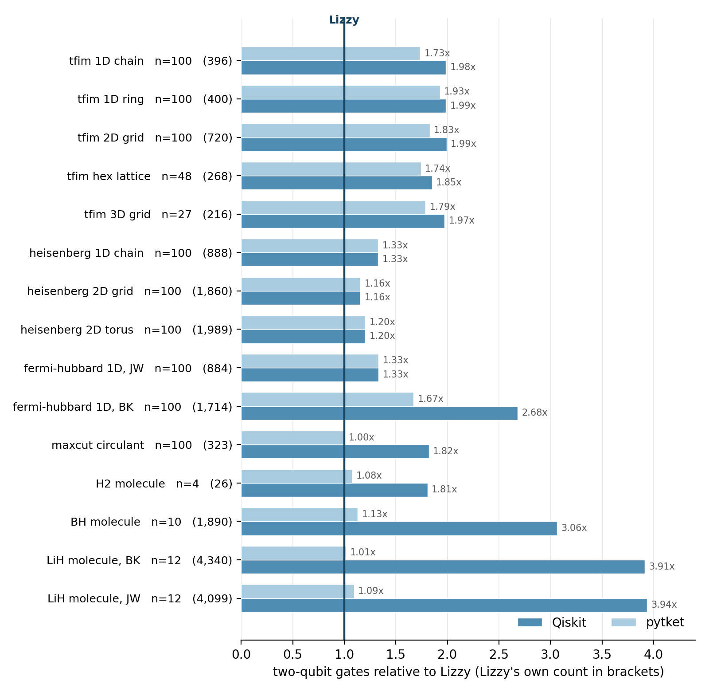

# Lizzy

Structure-aware unitary synthesis for Pauli Hamiltonians, plus an explicit molecular
path backed by OpenFermion and ffsim. Lizzy uses the dynamical Lie algebra (DLA) to
recognize exact `so(m)` and hybrid free-fermion opportunities, then prices those
routes alongside product-formula and emission alternatives. For generic chemistry,
the DLA is a filter and special-case detector, not a cost predictor. Representation-
dependent Pauli structure guides emission, while fermionic structure is retained for
explicit molecular routes and future accuracy-matched selection.
Opt-in numerical small-DLA synthesis provides static/driven Wei–Norman circuits
and Magnus4/Fer4 prototypes, with empirical accuracy/cost comparisons rather than
certified error budgets. Wei–Norman includes phase-preserving native gate emission
and OpenQASM 3 export.

Named in honor of [Elizabeth Meckes](https://en.wikipedia.org/wiki/Elizabeth_Meckes)
(1980–2020), mathematician of the classical compact groups — the exact branch of this
compiler lives on them.

```python
from lizzy.hamiltonian import model
from lizzy.synthesize import synthesize

result = synthesize(model("tfim", 100), time=10.0, error=1e-3)
result.routes           # ['exact'] — fixed depth, whatever the time
result.emission_backend # builtin, native-frame, pytket-direct, or pytket-greedy
result.two_qubit_gates  # count of that concrete emitted circuit
result.logical_two_qubit_gates  # builtin count of the verifiable Pauli sequence
result.error_guaranteed # True here; fixed-step/calibrated/sampled formulas are False
result.routing_estimated # True if any oversized candidate used the 1/2/4 cost model
```

## The route

```
H, t, budget (or a fixed step count)
 ├─ split exactly commuting summands via the anticommutation graph
 ├─ classify only manageable components/subsets with PauLie
 └─ per summand, price every available candidate and keep the cheapest:
      exact      so(m) → one orthogonal matrix, reduced to adjacent Givens
                 rotations along the Majorana line         [depth flat in t]
      hybrid     free subalgebra compiled exactly inside each second-order
                 step, as one more summand
      clusters   S2 over commuting clusters
      kernels    S2 over two-qubit kernels, fields folded in (≤3 CNOTs each)
      terms      S2 over the terms as given, ungrouped
      chain      the requested Suzuki order, sized by the chain bound
      (sampled)  qDRIFT on the small terms, only with randomized=True
```

Each manageable candidate is built for its full step count and folded before it is
priced. For a projected sequence above 20,000 rotations, one, two and four repetitions
shortlist the route; the winner alone is then fully built and quoted. This keeps tight
error budgets from materializing millions of rotations merely to reject them. The
model is a routing heuristic rather than a lower bound, so `Result.routing_estimated`
records whenever it participated; it does not weaken the independently sized product-
formula error guarantee.

The builtin emission charges CNOT ladders, merging runs that fit on one qubit pair into
a canonical KAK block. A second dependency-free backend, `native-frame`, keeps a
signed symplectic tableau and emits a concrete `H/S/Sdg/CX/Rz` circuit. With pytket
installed, the portfolio additionally tries the established decomposed-box
`GreedyPauliSimp` route and a faster direct route that presents intact `PauliExpBox`
objects to the pass. The direct route shortlists candidates, the winning route receives
the slower pass, and the complete final circuit is quoted once more.
`Result.emitted_circuit`, `Result.emission_backend`, and `Result.two_qubit_gates`
therefore refer to the same concrete artifact; `Result.circuit` remains the logical
Pauli sequence used for provenance and dense verification.

The native frame is selected from representation-dependent GF(2) invariants, not from
the DLA name alone. If the Pauli span has rank `r` and its restricted symplectic Gram
matrix has rank `g`, its canonical support needs `r-g/2` qubits. An abelian span is
stabilizer-reduced jointly. The non-degenerate `r=g=2` case is exactly one disguised
logical qubit (`su(2) ≅ so(3)`): one Clifford maps every dependent word to signed
`X`, `Y` or `Z` on that qubit, all rotations run inside it, and the frame is paid only
on entry and exit. A three-qubit example drops from 24 logical CX across a repeated
formula to 4 emitted CX; three GHZ stabilizers drop from 8 to 4. Signed tableau phases
matter here: an anticommutation graph without the GF(2) dependencies is not a valid
certificate, and a rank-three triangle is deliberately not collapsed to one qubit.

Routes are still selected per commuting DLA summand. The final quote can share a
Clifford frame across the concatenated result, but it does not reopen the Cartesian
product of discarded per-summand route choices; a bounded global beam is the next
router-level optimization rather than an implied guarantee of this emission refactor.

Molecular input has a separate route because converting it to Paulis throws away the
orbital tensors that route needs. The implementation is intentionally a thin adapter:
OpenFermion owns `FermionOperator` algebra and JW/BK encodings; ffsim owns double
factorization, number/Z conversion, Givens decomposition, adjacent-frame merging and
the DF-Trotter gate. Lizzy retains a validated tensor façade, the HamLib/layout bridge,
Qiskit count/provenance metadata and optional policies around that upstream baseline.
The default preserves ffsim's factor order. Givens-distance/2-opt reordering is an
explicit experiment under the canonical name
`frame_ordering="experimental-givens"`, because it changes the finite-step
approximant and has no accuracy certificate. The former name `"portfolio"` remains a
deprecated alias.

Ordinary full-rank noncommuting weight-one/two formulas stay on the builtin fast path.
The native backend is tried for abelian spans and for the certified one-logical-qubit
case `r=g=2`. Its general rolling emitter remains available as a direct API, but is not
repeated during route search: on larger nonabelian chemistry spans it is currently
slower and emits more gates than pytket. The broader optional shared-frame passes are
tried for any weight-three-or-higher sequence and for globally commuting weight-two
sequences such as MaxCut. In fixed-step high-weight mode, an
`independent_set` colouring is also priced alongside the default `largest_first`
partition. Error-budget mode retains the default partition because every alternative
would need its own order-dependent error constant.

Pricing emission inside the routing decision is what makes the `terms` candidate worth
having: ungrouped it emits badly as ladders, but a shared frame would rather see the
sequence as given, and that combination takes the largest chemistry instances.

`lizzy.frame` moves a Hamiltonian to a better Pauli representation before compiling.
The representation is a choice and it decides whether the exact tools apply at all:
the same Fermi-Hubbard model is fully two-local under Jordan-Wigner and 58% two-local
under Bravyi-Kitaev. PauLie classifies both as `4*so(6)`, one algebra, so the better
form is Clifford-reachable rather than lost. Following
[Aguilar et al.](https://arxiv.org/abs/2408.00081), Clifford equivalence needs a shared
anticommutation graph *and* shared algebraic dependencies — matching on the graph alone
leaves dependent generators unplaceable — and with both respected Witt's theorem turns
the isometry into a symplectic map. Handed the Bravyi-Kitaev form, the frame recovers
the Jordan-Wigner cost exactly: 20, 40 and 56 gates at 4, 6 and 8 qubits against 42,
124 and 156, spectrum preserved to 1e-14. The published alternative
[anneals on Pauli weight](https://arxiv.org/abs/2502.11933) for 15–40%.

`symmetry.taper` removes one qubit per commuting conserved charge, rotating each onto
a single-qubit Pauli and fixing its eigenvalue
([Bravyi et al.](https://arxiv.org/abs/1701.08213)). It is a problem reduction rather
than a compilation choice — the result acts on fewer qubits and holds only the chosen
sector — so it is explicit, not automatic. In the default `++++` sector, BH loses four
of ten qubits and mean Pauli weight drops from 4.8 to 3.8, taking the current portfolio
from 1,683 to 1,058 CX. LiH loses four of twelve; BK falls from 4,180 to 3,117 and JW
from 3,892 to 3,147. Every compiler benefits from it, so the comparison below is
untapered throughout.

Step counts come from the collected commutator bound
([Childs et al.](https://doi.org/10.1103/PhysRevX.11.011020), tight second-order
constants with cancellation between chains kept), so sizing needs no oracle;
`bench.calibrate` measures the remaining overshoot per instance where a dense
reference exists. Fully commuting Hamiltonians compile in one exact step. Every
two-qubit kernel decomposition is verified against its own 4×4 exponential at
synthesis time.

The sampled candidate uses qDRIFT
([Campbell](https://doi.org/10.1103/PhysRevLett.123.070503)), whose cost depends on
the coefficients rather than the term count. It is off by default and stays off:
its guarantee is on the averaged channel, not on the circuit you get, so a route
that wins on gate count can still miss the budget it was sized for.

## Numerical Wei–Norman synthesis

`lizzy.wei_norman.synthesize_wei_norman` compiles static or time-dependent Pauli
Hamiltonians into concrete `H/S/Sdg/CX/Rz` gates, with global phase retained and
OpenQASM 3 export. This is a numerical implementation of an established method,
not a newly discovered decomposition or a universally better synthesis route.

```python
import numpy as np
from lizzy.driven import DrivenHamiltonian
from lizzy.wei_norman import synthesize_wei_norman

drive = DrivenHamiltonian(
    ["XXX", "XXY", "IIZ"],
    lambda t: [np.cos(1.7 * t), np.sin(1.7 * t), 0.3],
)
result = synthesize_wei_norman(drive, (0.0, 1.2), max_step=0.02)
result.circuit                   # logical Pauli rotations
result.emitted_circuit           # concrete NativeCircuit, including global_phase
result.two_qubit_gates           # actual CX count of that artifact
result.component_dimensions      # (3,)
result.rhs_evaluations           # includes rejected integration attempts
qasm = result.emitted_circuit.to_qasm3()
```

The same route is explicitly available through the main static API:

```python
from lizzy.hamiltonian import model
from lizzy.synthesize import synthesize

result = synthesize(
    model("tfim", 3), time=1.0, method="wei-norman",
    numerical_options={"rtol": 1e-10, "atol": 1e-12},
)
result.numerical.charts
result.error_guaranteed          # False: the requested static `error` is NOT certified
```

The default `method="auto"` keeps the established static router and its error
contract; it does **not** silently introduce an uncertified numerical candidate.
Product-formula settings such as `steps` cannot be combined with the explicit
Wei–Norman route. Local solver tolerances belong in `numerical_options`.

The end-to-end interface adds:

- Structural splitting into anticommutation-connected control components. Different
  components commute at **all pairs of times**, so separate integration introduces
  no splitting error. This can handle many independent small algebras without one
  large Jacobian. `split_components=False` enables an explicit unsplit comparison.
- Per-component closure limits (`max_dimension=32`), a total closure limit
  (`max_total_dimension=1024`), and shared RHS/chart budgets across every component
  and pulse interval. All closures are checked before a driven callback is evaluated.
- Explicit `breakpoints=[...]` for known pulse discontinuities, in integration
  order. Each pulse uses one-sided endpoint values. Callbacks must be deterministic
  and all potentially active controls must be declared. Smooth controls still need
  an appropriate `max_step`; unannounced narrow pulses can be missed.
- Direct angles for static commuting components, and phase-preserving native
  emission for the complete result. The fixed portfolio compares actual ladder
  and eligible shared-frame circuits, including their entry/exit gates, by CX then
  total gate count. `emission="ladder"` forces the fallback; `"none"` skips emission.

`logical_two_qubit_gates` retains Lizzy's existing block-aware **cost estimate**;
it is not interchangeable with the concrete native gate count. No dense
`2**n` matrix is constructed by this synthesis interface. Neither numerical
integration nor chart restarts supply a global error bound or optimality guarantee.

### Low-level driven solver

`lizzy.driven` adds an explicit numerical Wei–Norman route for
`H(t) = sum_j c_j(t) P_j`. It closes the declared Pauli controls under commutators,
constructs their adjoint actions using PauLie products, integrates scalar angle
equations with SciPy, and returns the same `Circuit` used by Lizzy's emitters. It
does not construct a `2**n` matrix during synthesis or change the default static router.

```python
import numpy as np
from lizzy.driven import DrivenHamiltonian, synthesize_driven
from lizzy.emit import best_emission

drive = DrivenHamiltonian(
    ["X", "Y", "Z"],
    lambda t: [np.cos(1.7 * t), np.sin(1.7 * t), 0.3],
)
result = synthesize_driven(drive, (0.0, 1.2), max_step=0.02)
result.dimension          # 3: the full control-generated Pauli closure
result.chart_restarts     # extra local coordinate charts used
result.error_guaranteed   # False: local ODE tolerances are not a global error bound
emission = best_emission(result.circuit, drive.n_qubits)
```

The method is established [Wei–Norman/Lie-algebra decoupling](https://doi.org/10.1103/PRXQuantum.6.010201),
not a new Lizzy decomposition theorem. The prototype supports real, smooth control
callbacks at absolute time, forward/backward intervals, central identity phases,
and explicit permutations of the full factor basis. It caps closure dimension
(32 by default), bounds numerical work, and retries shorter intervals when chart
angles or Jacobian conditioning become unsafe. Central generators do not require
chart restarts. Failures raise instead of returning a partial circuit.

This is numerical synthesis without a Trotter splitting, **not** certified exact
synthesis: integration error remains, conditioning is sampled, and chart restarts
can make depth grow with time. Supply every potentially active Pauli control even
if initially zero; set `max_step` to resolve the fastest control timescale and split
discontinuous pulses into separate calls. The full closure may still be exponential,
so no generic molecular-chemistry advantage is implied.

Symdyn already derives Wei–Norman equations **and numerically integrates them**
through `scipy_solve` ([source](https://gitlab.com/VolodyaCO/dynamics-of-sun-systems/-/blob/main/src/symdyn/algebra.py)). Its
[current dependency constraints](https://gitlab.com/VolodyaCO/dynamics-of-sun-systems/-/blob/main/pyproject.toml)
include NumPy 1.26 and an older JAX stack; this Pauli-only numerical prototype uses
Lizzy's existing PauLie/SciPy dependencies rather than adding a symbolic engine.
General symbolic or numerical Wei–Norman automation is not claimed as a Lizzy
contribution. The mapping from driven equations to sequential gate parameters
also predates this implementation ([Altafini, 2002](https://arxiv.org/abs/quant-ph/0203005));
more recent chemistry work constructs compact Wei–Norman excitation circuits
([Magoulas–Evangelista](https://arxiv.org/abs/2511.13485)). We do not claim the first
Wei–Norman circuit-synthesis software.

### Magnus4 and Fer4

`lizzy.expansions` provides the published fourth-order Gauss–Legendre Magnus and
two-factor Fer schemes ([Blanes et al., equations 22–24](https://personales.upv.es/serblaza/2011EncyclopediaFerMagnus.pdf)).
Each time step samples two control vectors and collects their commutators in the
bounded Pauli closure. Magnus4 produces one effective exponential per step; Fer4
produces up to two, including the nested-commutator correction needed for fourth
order. Both are implemented in coefficient space, without dense qubit matrices.

```python
from lizzy.expansions import expand_driven, synthesize_expansion

plan = expand_driven(drive, (0.0, 1.2), method="magnus4", steps=32)
plan.exponentials         # 32 Pauli-SUM exponentials, not 32 gates
result = synthesize_expansion(drive, (0.0, 1.2), method="fer4", steps=32)
result.exponentials       # 64 before compiling them into Pauli rotations
result.circuit           # ordinary Lizzy Circuit; all emitted rotations are charged
result.compilation_segments
result.error_guaranteed   # False
```

`ExpansionPlan.factors` are coefficient vectors in circuit application order:
each represents `exp(-i sum_j factor[j] * P_j)`. Mutually commuting active terms
emit directly; noncommuting exponentials reuse the numerical Wei–Norman compiler.
`rtol`/`atol` control that internal synthesis, **not** Magnus/Fer truncation error.
The expansion step count is explicit, closure and factor counts are capped, and
the numerical work budget is shared across all factors. Reverse-time intervals,
central identity phases, and zero-duration evolutions are supported. Fer4 is not
exactly time-reversal symmetric at finite step size.

Quadrature, truncated time ordering, and numerical gate synthesis are separate
error sources. The methods preserve unitary circuit structure but do not certify
accuracy; neither two control samples nor local ODE tolerances establish a global
error bound. Resolve fast controls with the time-step mesh and split discontinuous
pulses. For static `H`, the correction vanishes: `exp(-itH)` still needs synthesis.
Interaction-picture selection and automatic numerical method selection remain future work.

### Empirical driven benchmarks

Run `python -m lizzy.driven_bench` for driven-spin and three-qubit Ising checks against
analytic or independent dense references. Wei–Norman, Magnus4, Fer4 and a midpoint
second-order product formula share a measured operator-error threshold. All use the
same fixed concrete native-ladder/native-frame emission portfolio; the benchmark also reports
logical counts so savings erased by shared-frame emission remain visible. These
small-instance checks are empirical, not certified error bounds or a routing policy.
[Recorded results](docs/driven_benchmark.txt) at operator-error threshold `1e-6`:

| Case | Closure dimension | Wei–Norman CX | Magnus4 CX | Fer4 CX | Midpoint-S2 CX |
|---|---:|---:|---:|---:|---:|
| Rotating spin | 3 | 0 | 0 | 0 | 0 |
| Encoded spin (`XXX`, `XXY`, `IIZ`) | 3 | 4 | 4 | 4 | 4 |
| Driven three-qubit TFIM | 15 | 256 | 512 | 1,024 | 4,100 |

These columns count actual emitted CX gates. Earlier TFIM values of 160/320/640
were analytical pair-block estimates, not gates emitted by this portfolio; the
benchmark now keeps those estimates only in the separate `logical_CX` column.

The product-formula search first passes at 1,024 steps in each case. Magnus4/Fer4
use 32 steps on the spins and 16 on TFIM; Wei–Norman uses eight charts on TFIM.
Expansion plans are screened against dense references on a power-of-two grid
before compilation; the final compiled/emitted circuit must independently pass.
This is a small-instance oracle benchmark, not deployable accuracy-based routing
or a minimal-step claim. The output separates `plan_error` (before compilation)
from `op_error` (total error of the final circuit), and abstract factor counts from
rotation/CX counts. `--max-expansion-steps` and `--max-steps` bound the two searches;
an unmet target produces a failing exit status.

On TFIM, Magnus4's total error is `7.64e-8` and Fer4's is `4.44e-7`, but the existing
Wei–Norman route still emits fewer CX. The encoded spin has no additional CX saving
after the common shared-frame emitter. These comparisons are not against all
available driven/free-fermion methods and are not evidence of a chemistry advantage.

### Broader synthesis comparison: Wei–Norman is not always better

Run `python -m lizzy.synthesis_bench` for 14 reproducible static and driven cases:
commuting controls, physical/encoded spins, independent commuting `su(2)` factors,
short/medium/long TFIM evolution, generic `su(4)`, and a `su(8)` closure-cap case.
Use `--case short-tfim3` to select a case or `--json` for case definitions, versions,
settings, error measurements and timings. A complete
[recorded run](docs/wei_norman_benchmark.json) contains 33 passing comparisons,
eight unsupported static-exact cases, and one explicit Wei–Norman closure cap.
The comparison includes Wei–Norman,
midpoint-S2, and the existing static exact route wherever supported.

All methods share a fixed **concrete native ladder/shared-frame portfolio**.
Counts below are actual CX gates in the emitted artifacts, not block-aware
logical estimates. Default measured threshold: `1e-6`.

| Case | Wei–Norman CX | Midpoint-S2 CX | Static exact CX |
|---|---:|---:|---:|
| Short TFIM3, `t=0.003` | 32 | **8** | 28 |
| Static TFIM3, `t=1` | 256 | 2,052 | **28** |
| Long TFIM3, `t=5` | 1,024 | 16,388 | **28** |
| Driven TFIM3 | **256** | 4,100 | unsupported |
| Driven encoded spin | 4 | 4 | unsupported |

The static exact solver returns the spin-cover representative up to global phase;
PASS for that route uses the reported trace-phase-aligned operator norm. The
strict operator error is printed separately (including a value of 2 for `-U`).
Wei–Norman must additionally pass the **strict**, phase-preserving norm. Emitted
and logical circuits must agree in strict norm for every route. None of these
empirical checks is a certified global error bound.

Other qualifications matter: the encoded-spin CX tie hides 55 versus 10,257 total
native gates; the full `su(8)` case exceeds the default Wei–Norman dimension cap
while the product formula succeeds. The cap is configurable: running that case
with `--max-dimension 64` succeeds at dimension 63 with 324 Wei–Norman CX versus
512 product-formula CX, at higher classical compilation cost. Known unsupported exact embeddings are
reported with reasons, not omitted or counted as wins. `CAP`, `UNSUPPORTED`,
integration failures and exhausted step searches remain visible in the output.

Timings separate final synthesis/emission from the product-formula accuracy search
and dense verification, and are single-run wall times with ordinary caches—not
controlled performance measurements. The power-of-two step search and dense
references are small-instance oracles, not a scalable automatic router. Even
allowing the product formula these oracle-selected steps does not make either
method universally dominant. This supports a **portfolio of routes**, not replacing
the existing exact and product-formula methods with Wei–Norman everywhere.

## Measured

Fifteen HamLib instances, the same fixed-depth task for every compiler (two Suzuki-2
steps at t=1), two-qubit gates after each compiler's best effort — Qiskit at
`optimization_level=3` and the better of its default and Rustiq synthesis, pytket at
the better of `GreedyPauliSimp` and `FullPeepholeOptimise`. Bars are each compiler's
cost as a multiple of this one, with Lizzy's own gate count in brackets. Reproduce
the numbers and overwrite the checked-in figure with `python -m lizzy.compare`. The
snapshot below was regenerated on 2026-09-04 with Qiskit 2.5.1 and pytket 2.18.1:



Rustiq is Qiskit's Pauli-network plugin, folded into the Qiskit bar. It is the better
of the two on chemistry, where sharing a Clifford frame pays, and much the worse
everywhere else — 57 620 gates against 2 151 on the 2D Heisenberg grid, since
preserving rotation order leaves a network with nothing to share.

**Pauli structure, not algebra dimension, predicts the emission.** At fixed
`steps=2`, the current portfolio gives H2-BK 26 CX instead of 76 builtin, BH-BK 1,683
instead of 7,426, LiH-BK 4,180 instead of 22,946 and LiH-JW 3,892 instead of 26,790.
BH chooses eleven `independent_set` clusters; both LiH encodings keep term order and
choose direct intact-box emission. LiH-BK and LiH-JW nevertheless have the same DLA,
`16*su(256)+2*u(1)`, so a DLA label or dimension cannot select the backend alone.

Weight, support overlap, symplectic dependencies and the anticommutation graph supply
the missing representation-dependent information. The Givens route still needs the
whole algebra to be `so(m)`, and pair kernels still need every term to fit one qubit
pair; above that, shared parity/Clifford structure is what the emission portfolio can
reuse.

`lizzy.frame` closes that gap only where a lighter representation exists, and
sometimes none does. Anticommutation degree is a Clifford invariant. Among distinct
nonidentity Paulis of weight at most two on `n >= 2` qubits, the sharp maximum degree
is `12n-16`: a weight-two Pauli has four single-qubit neighbours, four neighbours on
the same support and `12(n-2)` on a one-qubit-overlapping support. BH reaches degree
124 against the ten-qubit limit 104; LiH reaches 264 against the twelve-qubit limit
128. No Clifford can therefore make every term of either Hamiltonian two-local. This
does not rule out fragment- or DLA-aware synthesis; it rules out that particular
termwise two-local frame.

The obvious multi-DLA extension was measured and rejected for chemistry. A weighted
anticommuting-pair search finds a 13-term `so(10)` fragment in BH and a 30-term
`so(12)` fragment in LiH, but their exact Givens networks cost more than the internal
commutators they remove: at two steps BH rises from 1,683 to 1,834 CX, LiH-BK from
4,180 to 4,263 and LiH-JW from 3,892 to 4,039. The empty fragment plan therefore stays
the winner rather than turning a plausible algebraic idea into a regression.

The fermionic path is now treated as an **upstream baseline, not a demonstrated Lizzy
win**. With ffsim 0.0.84, Qiskit 2.5.1 and OpenFermion 1.8.1, LiH-12 has 21 retained DF
fragments. Across five fresh local processes, ffsim's original S2 order at `t=1`, one
step and optimization level 1 emitted 4,392--4,456 CX through the recommended
`ffsim.qiskit.PRE_INIT` pipeline; the explicit experiment emitted 4,120--4,220 CX.
The variation comes from equally valid numerical factor-frame gauges, so each result
records a `factorization_fingerprint`. More importantly, original and reordered
circuits implement different finite-step formulas. Until they are compared at a
common error target, the lower counts are not reported as a compiler improvement.
The earlier 4,188 accuracy-conditioned claim combined a recursive decomposition path
with an order-dependent sampled comparison and is intentionally retired.

The representation comparison remains explicit because ffsim groups all alpha modes
before all beta modes while HamLib interleaves them. Requesting interleaved output
inserts the required fermionic parity conjugation rather than counting the mode
permutation as free. Fixed-step sampled accuracy is not a general error certificate,
so DF remains an explicit API rather than silently replacing the error-budgeted
generic router.

At matched accuracy — eight qubits, every compiler given the fewest steps that reach
1e-3 against a dense reference — the current valid rows are:

| model | t | Lizzy | Qiskit | pytket |
| --- | ---: | ---: | ---: | ---: |
| TFIM | 1 | 42 | 60 | 51 |
| TFIM | 8 | 122 | 588 | 533 |
| Heisenberg chain | 1 | 93 | 291 | 147 |
| Heisenberg chain | 8 | 1,206 | 3,797 | 1,869 |
| Heisenberg all-to-all | 1 | 2,892 | 5,420 | **2,469** |

Lizzy wins the four chain rows, including 122 against the next-best 533 for TFIM at
`t=8`, but it does not win the dense all-to-all case. The all-to-all `t=4` row is
deliberately excluded: the previous capped search returned step 64 even though the S2
comparator still missed 1e-3 there, so it never established a valid matched-accuracy
count. The benchmark now scans every integer step through the cap — finite-step error
need not be monotone — and rejects the row if none passes.

**Not every compiler can be scored this way.** Checked against a dense reference on a
duplicate-free Trotter step, only pytket, Qiskit's `PauliEvolutionGate` and Lizzy
reproduce the sequence they are given (infidelity ≤ 2e-16). Paulihedral, Tetris,
PauliOpt and [PHOENIX](https://github.com/iqubit-org/phoenix) reorder non-commuting
terms — legitimate for a Trotter approximation, but the circuit then implements a
different unitary and its gate count is not comparable. Such compilers have to be
scored on accuracy instead. Scored that way, PHOENIX needs 238 gates where Lizzy needs
42 (tfim, t=1), 420 against 93 (heisenberg, t=1) and 3 213 against 1 206 (heisenberg,
t=8): it buys cheaper steps with more of them, because reordering costs Trotter
accuracy. Paulihedral and Tetris are absent because their output could not be verified
against a reference under any convention tried.

The compiler is about 5,800 lines of Python across eighteen package files. The algebra
lives upstream in PauLie and kak-tools, while emission backends stay behind the same
priced-candidate interface.

## Verification

`lizzy.dense` rebuilds circuits as 2^n matrices and compares them to `expm(-itH)`,
so every exactness claim is checked at the qubit level wherever size allows; the
test suite is built on it. Kernel decompositions self-verify at any width.
Driven routes additionally use analytic rotating-field solutions and independent
dense ODE references. Magnus/Fer tests check fourth-order convergence, quadrature
error, factor order, global phase, and numerical compilation separately.

The reported gate count is block-aware: a run of consecutive rotations that fits on a
single qubit pair compiles as one canonical block, charged what its KAK class costs —
three CNOTs when all three canonical parameters are non-trivial, two when at least
one is, none when the block is local —
and a wider rotation pays its CNOT ladder. Pricing the class rather than capping at
three is what an XY-type bond is worth: the flat cap overcharged 61% of pair blocks in
a random sweep and never undercharged, so the counts it reported were reachable but
pessimistic. Emitting the circuits explicitly confirms the count on both sides of that
change (1 440 reported, 1 440 emitted at tfim 2D; 884 and 884 on Fermi-Hubbard under
Jordan-Wigner, where the cap said 1 063).

```bash
pytest                   # dense/unit checks; HamLib archives download on first use
python -m lizzy.driven_bench  # empirical, accuracy-matched driven-spin checks
python -m lizzy.bench    # per-instance route, cost, achieved error
python -m lizzy.compare  # the tables above (needs the compare extra)
```

## Install

Python 3.12 or newer is required. `kak_tools` is not on PyPI and cuts no releases,
so install a pinned revision before Lizzy. The revision matters: since kak-tools
dropped its `DLAInfo` wrapper, `map_dla_to_irrep` hands back PauLie's
`Classification` directly, and `lizzy.exact` reads the irrep size off it. Earlier
revisions return the wrapper and fail here.

```bash
python -m pip install \
  "kak_tools @ git+https://github.com/QPauLie/kak-tools.git@3980728596a060a7db2cf5f541a4aaf9011a9b1d"
python -m pip install -e .
python -m pip install -e '.[hamlib]'    # Pauli-form HamLib loading
python -m pip install -e '.[chemistry]' # molecular HamLib + OpenFermion/ffsim/Qiskit
python -m pip install -e '.[compare]'   # Qiskit/pytket comparison
python -m pip install -e '.[hamlib,chemistry,compare,test]' # full test environment
```

PauLie 0.2.3 contains the required merged
[PR #232](https://github.com/QPauLie/PauLie/pull/232) and installs
`pauliebits>=0.1.1` from PyPI transitively; no separate pauliebits installation is
needed.

The explicit circuit API `synthesize_molecular_ffsim` preserves ffsim's factor order
and defaults to its block-spin JW layout (`qubit_order="alpha-then-beta"`). On that
API, requesting `qubit_order="interleaved"` inserts the fermionic parity-conjugation
network rather than treating the mode permutation as a free wire relabeling. The
OpenFermion conversion helpers instead default to interleaved mode order, matching
HamLib:

```python
from lizzy.chemistry import synthesize_molecular_ffsim, to_pauli_openfermion
from lizzy.hamlib import fetch, load_molecular
from lizzy.synthesize import synthesize

path = fetch("chemistry/electronic/standard/LiH.zip")
molecule = load_molecular(path, "ham_molec-12")
df = synthesize_molecular_ffsim(molecule, time=1.0, steps=1)
df.routing_mode                # "input"
df.factor_order_preserved      # True
df.two_body_tensor_max_abs_error  # diagnostic, not a unitary-error bound
df.accuracy_certified          # False
df.factorization_fingerprint   # identifies the upstream factor tensors/frames

paulis = to_pauli_openfermion(
    molecule, "jw", qubit_order="alpha-then-beta"
)
generic = synthesize(paulis, time=1.0, steps=2)

# Count-only experiment; not equivalent at finite step count.
trial = synthesize_molecular_ffsim(
    molecule, time=1.0, steps=1, frame_ordering="experimental-givens"
)
trial.routing_attempted        # True
```

## Outlook

Two questions decide whether the remaining gap can be closed at all, and they are
different questions because the two instances fail differently.

**BH: is there a useful non-Pauli frame?** A termwise two-local Clifford frame is
already ruled out: maximum anticommutation degree is 124, above the ten-qubit bound
104. No HamLib encoding reaches one either, and the measured exact Pauli fragments
regress. Any remaining opportunity must therefore change the representation more
substantially, for example through fermionic orbital frames, rather than search harder
inside the same Clifford orbit.

**LiH: how far can the physical route be pushed?** Not through a termwise two-local
Clifford representation — that is settled, degree 264 against 128. But high weight is
a property of the *fermionic basis*, not of the physics: molecular orbitals are a
choice like any other, and the
Coulomb interaction is only all-to-all in the basis one happens to write it in. Double
factorization already exploits this, rewriting the Hamiltonian as O(N) rotated
diagonal-Coulomb fragments. Pairwise basis distances and 2-opt over DF fragments also
already appear in Necaise et al.; their objective is distributed-QPU complexity rather
than local CX, but the abstract heuristic is prior art. The next question is therefore
predictive rather than novelty-by-reordering: can cheap structure features identify
which established representation reaches a common accuracy target at the lowest
actual cost?

The first feature ablation will combine the quantities already exposed here — Pauli
weight/ladder cost, anticommutation degree distribution, GF(2) span and Gram ranks,
extractable Z2 symmetries, commutator error constants and DF factor count — with two
features still to be surfaced from the chemistry internals: Coulomb density and
pairwise Givens-distance statistics. H2-4, LiH-8, BH-10 and LiH-12 will be compared in
one alpha-then-beta convention across JW, BK and ffsim DF at steps 1--3. The label is
the smallest actual CX count reaching the same seeded physical-sector infidelity
threshold, not the lowest count at an arbitrarily equal step number.

**A reference representation derived from the classification.** `lizzy.frame` needs a
target to move towards, and today that target is supplied. The classification already
names the canonical graph — PauLie's types A/B1/B2/B3 *are* the canonical forms of
[Aguilar et al.](https://arxiv.org/abs/2408.00081), and its tracked canonicalizer
records the contractions — so constructing the target from the classification alone is
reachable, and is what would make the frame apply to a Hamiltonian arriving without a
better twin.

**More emission backends, priced rather than written.** Emission is a portfolio with
two dependency-free and two optional pytket entries; nothing limits it to those four.
Each candidate returns an `EmissionQuote` containing a backend name, actual two-qubit
count and the exact artifact whose gates were counted. Adding another unitary-
preserving backend is therefore monotone: it is retained only where it wins. Optional
imports are how a small compiler stays competitive on families it was never
specialised for; the work is keeping the interface narrow and verifying each artifact
densely at small width.

**Fast-forwardable fragments.** The exact route fires when the whole algebra is
`so(m)`; a double-factorized Coulomb fragment is different: a Gaussian orbital basis
change surrounds a diagonal `n_i n_j` evolution. HamLib already includes the required
`ham_molec-*` tensors, and the new molecular loader preserves them instead of trying to
infer them from an encoded Pauli operator. ffsim performs the factorization and circuit
construction; the open work is stronger cross-fragment frame sharing and a scalable
sector-aware error bound, not another greedy Pauli cover.

Also open, in measured order of value: applying tapering automatically once a sector is
specified; the 17 commuting clusters chemistry produces against three for spin models;
symmetry protection, a no-op where terms conserve the charges individually and untested
where they do not; and vectorizing the commutator walk, which exhausts its budget on
all-to-all models around n=24.

**Measured and rejected.** Parity networks for diagonal clusters, which looked like
the answer to maxcut: instead of a ladder per term, carry a linear map and pay only
what separates one parity from the next. Built and dense-verified, the network needs
294 CNOTs on maxcut against the ladder's 400 — but the map drifts far from the
identity and restoring it costs 2 403, a cost the naive Gaussian elimination cannot
avoid for a full-rank drift on 100 qubits. Constraining the drift gives the ladder back
exactly. The restore is paid once and the network per step, so the break-even is 23
Trotter steps; a fully commuting Hamiltonian needs one, which is precisely the worst
case for amortizing it. Worth revisiting only for diagonal parts inside deep circuits.

Widening the kernels past two qubits: a general three-qubit
unitary costs about twenty CNOTs, so such a kernel pays only where five or more terms
share a triple, while on LiH 509 of 630 terms are too wide to fit one at all and those
that fit share a triple 2.9 times. Recognizing free-fermions-in-disguise: the
frustration graph is already built, but even-hole-free recognition is O(n^9) at best,
so the condition can be ruled out by the cheap claw-free half and never ruled in.

## References

- Kökcü et al., [Fixed depth Hamiltonian simulation via Cartan decomposition](https://doi.org/10.1103/PhysRevLett.129.070501) — the exact branch
- Wierichs et al., [Recursive Cartan decompositions for unitary synthesis](https://arxiv.org/abs/2503.19014) — what kak-tools implements
- Qvarfort & Pikovski, [Solving quantum dynamics with a Lie-algebra decoupling method](https://doi.org/10.1103/PRXQuantum.6.010201) — the experimental driven Wei–Norman route
- Martínez-Tibaduiza et al., [Symdyn: An automated algebraic solution for high-order quantum systems](https://doi.org/10.1103/24r3-j9zy) — existing symbolic Wei–Norman automation
- Blanes et al., [Magnus and Fer expansions for matrix differential equations: the convergence problem](https://doi.org/10.1088/0305-4470/31/1/023) — expansion/convergence background; no global certificate claimed here
- Blanes et al., [The Fer and Magnus expansions](https://personales.upv.es/serblaza/2011EncyclopediaFerMagnus.pdf) — equations 22–24 implemented by the Magnus4/Fer4 routes
- Wiersema et al., [Classification of dynamical Lie algebras of 2-local spin systems](https://doi.org/10.1038/s41534-024-00900-2) — why polynomial DLAs are a chain phenomenon
- Childs et al., [Theory of Trotter error with commutator scaling](https://doi.org/10.1103/PhysRevX.11.011020) — the step counts
- Decker et al., [Kernpiler](https://arxiv.org/abs/2504.07214) — partial Trotterization, the kernels
- Kivlichan et al., [Quantum simulation with linear depth](https://doi.org/10.1103/PhysRevLett.120.110501) — the Givens emission
- Motta et al., [Low-rank representations for quantum simulation of electronic structure](https://arxiv.org/abs/1808.02625) — double factorization
- McClean et al., [OpenFermion](https://doi.org/10.1088/2058-9565/ab8ebc) — fermionic operators and encodings used here
- [ffsim](https://github.com/qiskit-community/ffsim) — molecular factorization and DF-Trotter circuit backend used here
- Necaise et al., [Distribution complexity of electronic-structure simulations](https://arxiv.org/abs/2606.20805) — pairwise DF-frame distances and 2-opt prior art
- Chen et al., [PHOENIX](https://arxiv.org/abs/2504.03529) — global Pauli-IR optimization, compared against
- Goubault de Brugière & Martiel, [Rustiq](https://arxiv.org/abs/2404.03280) — the Pauli-network synthesis Qiskit ships
- Elman, Chapman & Flammia, [Free fermions behind the disguise](https://arxiv.org/abs/2012.07857) — solvability from the frustration graph
- Sawaya et al., [HamLib](https://arxiv.org/abs/2306.13126) — the instances
- Meckes, [The Random Matrix Theory of the Classical Compact Groups](https://doi.org/10.1017/9781108303453) — the namesake
