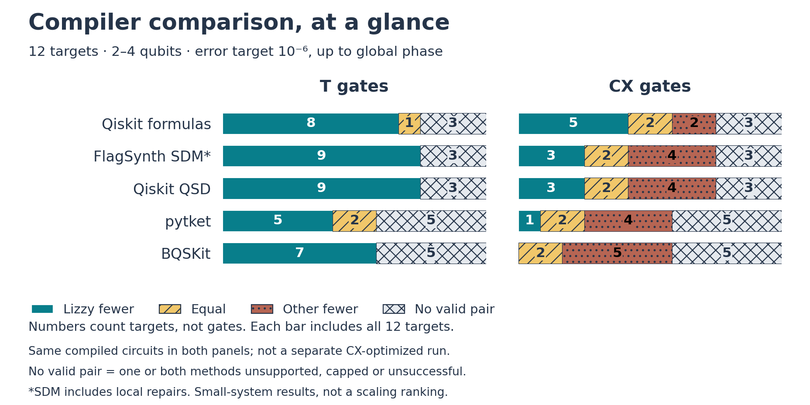

# Does structure lead to smaller circuits?

That is the question this comparison tests: **implement the same evolution at
the same checked accuracy, then compare the circuit cost.** T gates reflect
fault-tolerant cost; CX gates reflect two-qubit cost.

[Accessible SVG with detailed descriptions](figures/compiler-comparison.svg).

Each bar compares Lizzy with one compiler route. Numbers count test cases,
not gates. Gray cases are not wins: one or both methods lack a passing result.
Both panels use the **same compiled circuits**. Baselines are T-selected;
Lizzy additionally accepts shared-frame changes only when neither count increases
relative to its own original output. This is not a separate CX-optimized benchmark.

## What this tells us

Shared frames remove some avoidable CX overhead, but **fewer T gates still do
not necessarily mean fewer CX gates** compared with another compiler.
There is no universal winner.

These are small-system results, not evidence of better scaling. Unsupported
inputs remain visible, and the results do not establish an advantage for
general molecular chemistry.

The comparison concerns output circuits, not equal classical workloads:
some methods receive the Hamiltonian, others its full evolution matrix.
FlagSynth's SDM result includes disclosed local repairs. Different accuracy
settings can change the ranking.

[Measurements and reproduction](reproduce.md#compiler-comparison) ·
[Methods](methods.md) ·
[Overview](index.md)
