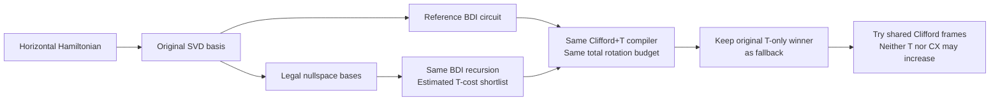
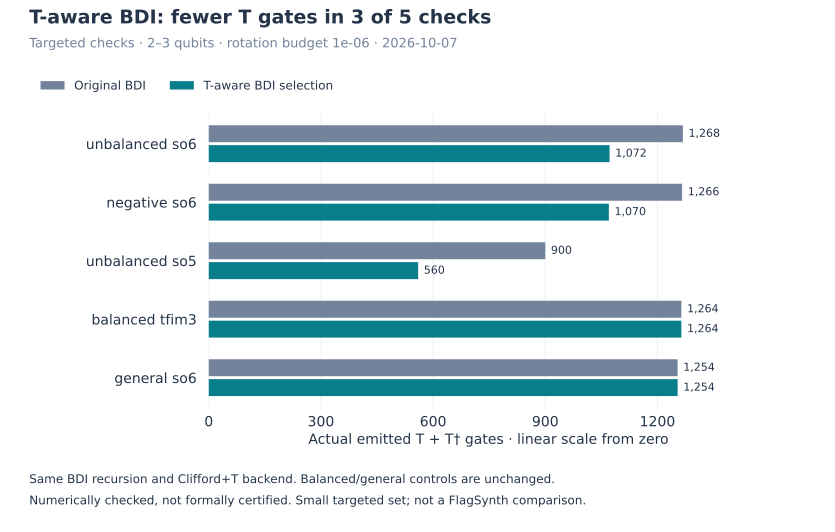

# Automatic T-aware synthesis

[Overview](../README.md) · [Synthesis](synthesis.md) · [Paper correspondence](cartan_review.md)

Lizzy compares complete BDI, Givens and eligible OpenFermion Gaussian circuits
using actual Clifford+T counts, then tries shared Clifford frames without
increasing either T or CX relative to its original T-only ladder winner.
BDI also offers a bounded search over its unused nullspace basis; its original
paper-recursive circuit remains a candidate. This is not a new factor-count
theorem or a globally optimal T compiler.

## Use it

Install the optional dependency with `python -m pip install -e '.[ft]'`.
Arbitrary-angle synthesis uses [pygridsynth](https://github.com/quantum-programming/pygridsynth);
it is a dependency, not vendored code. The recorded run uses version 2.0.0.

```python
from lizzy.hamiltonian import hamiltonian
from lizzy.synthesize import synthesize

H = hamiltonian({"XI": .37, "YI": -.61, "ZX": .83, "ZY": 1.13, "ZZ": -.29})
result = synthesize(H, time=.713, objective="t", error=1e-6)
print(result.t_count, result.t_selection.selected)
print(result.t_selection.candidate_t_counts)
print(result.t_selection.candidate_cx_counts)
print(result.emitted_circuit.rotation_error_bound)
qasm = result.emitted_circuit.to_qasm3()
```

`error` in this mode is a **rotation-approximation budget**, not a formal
end-to-end Hamiltonian-error certificate. Accordingly, `result.error_guaranteed`
is false. Automatic T synthesis compares whole-H BDI reference, optional BDI
nullspace optimization, Givens and the full quadratic Gaussian construction at
the same total budget, including all
commuting components. It retains the emitted winner and its actual counts in
`t_selection`. The former stable T-only winner is recorded as
`no_regression_reference`. Among ladder and shared-frame candidates with no
larger T **or** CX count than that reference, selection minimizes `(T, CX)`;
equal pairs keep stable route order. Valid trade-offs that violate either cap
remain in the diagnostics but cannot win. It does not independently choose
per-component T minima or enumerate every mixed assignment, since full-circuit
folding and precision allocation are not additive.

Use `method="bdi"` to restrict this to the paper BDI construction, or
`method="givens"` for its reference alone, or `method="gaussian"` for the
OpenFermion construction. Above eight modes, recognized quadratic inputs use
the available Gaussian route directly under the [documented search cap](synthesis.md#openfermion-quadratic-evolution).
A rejected optional candidate cannot
discard a valid reference; rejection reasons are recorded. If no exact method
can synthesize the input, auto T raises an error rather than silently switching
to product formulas or numerical Wei–Norman. Those alternatives require a
separate synthesis/error contract. Product-formula controls are rejected in T mode.
The default `objective="cx"` uses the broader static router, including both
exact decompositions and approximate alternatives.

The [joint T/CX experiment](../experiments/README.md#joint-t-and-cx-experiment)
motivated shared-frame integration. The broader gauge-candidate portfolio
remains experimental. Production frame search tries lookahead 0 and 8, at most
eight qubits and 256 logical rotations per full candidate. Above either cap,
the ladder reference remains usable and the skipped search is reported.

## What changes in the decomposition

For a horizontal generator `H = K A K†`, the SVD supplies a full basis for each
orthogonal block. If the BDI partition is unbalanced, some columns describe an
unused nullspace. Its orientation is not determined by H. Replacing `K` by `K M`
leaves the Hamiltonian unchanged whenever `M A M† = A`.

Lizzy tries up to eight deterministic QR-based nullspace completions. QR chooses
a basis; it does **not** substitute a Givens circuit. Every candidate is checked
for orthogonality, determinant and reconstruction, then passed through the same
balanced recursive BDI routine and paper plane ordering. Active columns and
Cartan rates are unchanged. The physical inverse wing is still obtained by
reversing and negating the selected wing.



The search currently uses structural nullspace freedom only. Additional freedom
from repeated or zero singular values is not exploited. Balanced and general
endpoint BDI therefore remain unchanged by this search. Raw rotation-count
bounds also remain unchanged: reducing non-Clifford cost is not the same as
reducing the number of parameter slots.

For reusable plans without installing the FT dependency:

```python
from lizzy.exact import prepare_bdi
from lizzy.hamiltonian import hamiltonian

H = hamiltonian({"XI": .37, "YI": -.61, "ZX": .83, "ZY": 1.13, "ZZ": -.29})
plan = prepare_bdi(H, optimize="t", rotation_error=1e-8)
print(plan.optimization)
logical = plan.circuit(.713)
```

Here `rotation_error` is **per rotation** and only informs the search estimate.
The estimate recognizes affordable Clifford/T angles and otherwise uses the
typical logarithmic cost model motivated by
[Ross–Selinger](https://arxiv.org/abs/1403.2975). It is not an upper bound or an
actual T count. The high-level path compiles both the original full circuit and
the shortlisted full circuit, including all commuting components, and compares
their actual counts. It records any rejected alternative rather than discarding
an already valid reference. This guarantees no larger T count than that compiled
reference among these candidates, not superiority to every possible compiler.

## Clifford+T output and accuracy

`compile_clifford_t(circuit, width, error=eps)` in `lizzy.clifford_t` can compile
any supplied logical Pauli sequence, including a separately computed Wei–Norman
output. This alone does not optimize Wei–Norman's coordinates or certify its ODE
error. Its output is an immutable `CliffordTCircuit` with concrete gates,
`t_count` (T plus T†), `n_2qb_gates()`, `inverse()`, `get_unitary()` and `to_qasm3()`.

This low-level function retains Pauli ladders; the high-level T selector also
uses `compile_frame_candidates` for bounded shared-frame alternatives. Both
use the same optional pygridsynth backend for generic Rz rotations.
It first recognizes affordable Clifford/T angles and charges their snapping
error. The remaining half-budget is shared uniformly only over generic Rz
occurrences; the other half is reserved for phase bookkeeping. Zero or fixed
Clifford rotations do not consume generic precision slots. This matters when
comparing SDKs that express fixed gates differently. Opposite angles reuse
exactly inverse gate words; the second
wing is not independently approximated. Adjacent inverse gates cancel, and
adjacent equal T gates combine into S.

`compile_native_clifford_t(native, error=eps)` applies the identical policy to
an existing H/S/S†/CX/Rz artifact, preserving an external compiler's entanglers.
The [matched compiler comparison](compiler_comparison.md) uses this entry point
for every method and checks every final artifact against its original target.

Each generic rotation is checked with high-precision arithmetic; a numerical
Frobenius error upper estimate bounds its operator error, and local estimates
are summed. `rotation_error_bound` has kind `numerical triangle bound`, not an
interval-arithmetic certificate. Floating-point Hamiltonian factorization,
ODE errors and physical hardware noise are outside this budget.

Global phase is retained as metadata and in dense/QASM output, but has no T
charge for an uncontrolled circuit. Controlled evolution requires implementing
that phase separately. Preserving metadata cannot repair the spin-cover phase
already lost by Givens or general endpoint BDI. The backend does not yet
optimize T-depth, use ancillas, or provide phase-gradient/QROM synthesis.

## Gauge-search measurements — before shared-frame integration



At rotation budget `1e-6`, all five targeted outputs passed an independent dense
operator-norm check. After the shared precision-allocation correction, unbalanced
so(6) changed from 1268 to 1072 T gates at positive time and 1266 to 1070 at
negative time; unbalanced so(5) changed from 900 to 560. Balanced TFIM3 and general
so(6) stayed at 1264 and 1254 respectively. Two rows share the same Hamiltonian,
so these are not five independent families. Maximum phase-appropriate measured
error was below `1.9e-8`.

The general endpoint row is checked **up to global phase**; its strict error
is approximately 2, reflecting the documented spin-cover sign. All horizontal
rows pass strict phase-sensitive checks. No FlagSynth, chemistry-wide, or
general T-optimality claim follows from this small experiment.

Raw records include coefficients, versions, gauge diagnostics, phase-aware errors
and actual counts: [bdi_t_results.json](../experiments/bdi_t_results.json). This
saved snapshot predates shared-frame integration. To measure the current path
without overwriting that historical gauge-only evidence:

```bash
python -m experiments.bdi_t_benchmark --output /tmp/lizzy-bdi-t-current.json
```

Use `--case unbalanced-so6` for one case. Timings include warmed caches and are
not presented as a speed comparison. The focused tests protect legal gauge
changes, reconstruction, factor order/phase, budget accounting, optional
dependency behavior, and final selection by actual rather than estimated cost.
